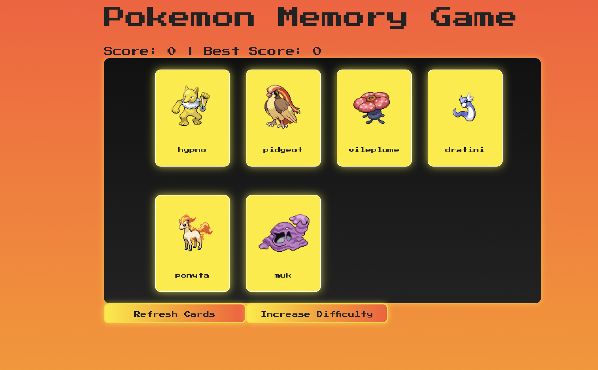
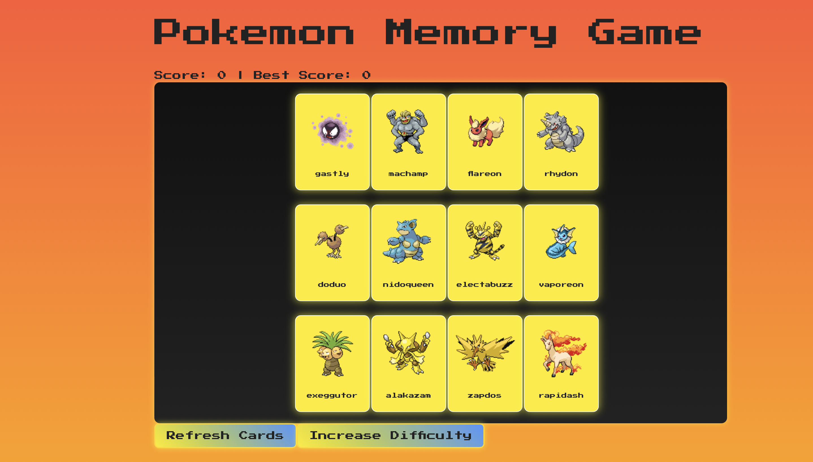
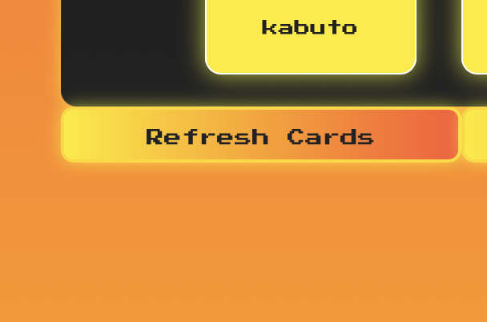

# **Memory Game-Odin**

## **Memory Game React Project**
This project is part of the React unit in the Odin Project under the "States and Effects" chapter. It is a pokemon card memory game thta allwos the user to refresh the set of cards randomly and increase diffcult by addign two cards up to a total max of 12 cards.

---

## **Application Screenshots**

### **Pokemon Game Base Difficulty**  
  

### **Pokemon Game Hardest Difficulty**  
  

### **Refresh Feature Images**  
  

---

## **Technologies Used**
- **React**: The core library for building the application.
- **HTML**: Provides the structure for the app.
- **CSS**: Styles and layouts for better user experience.
- **JSX**: React uses JSX, which is a syntax extension to write HTML-like code in JS.

---

## **Features Implemented**

### **Core Requirements:**
- **React:** Must be made using React
- **API:** Must get cards from using an API .
- **Components:** Must use multiple componenets for the React App for instance , the scoreboard.
- **Style:** Style the page with your choice of icons, pictures, fonts, etc.
- **Chnage of Cards:** Cards must randomize after each click.

### **Additional Features I Made:**
- **Icons:** I used many icosn to produce a user friendly and appealing to the eye content using font awesome that I lerned in a previous lesson.
- **Hover Effect:** I used some hovering effects and transition to showcase some css styling features I have used and learned during the project.
- **Difficulty Option:** The user can click the increase diffculty button to add 2 cards to the game to memorize.
- **Reshuffle Cards:** Generates new cards from the pokemon API.
   

---

## **Usage Guidelines**
1. Open the application using my github pages link.
2. Hover over the webpage to see the different css styles like color changes.
3. Click on a card to begin.
4. Try not pick the same card twice.

---